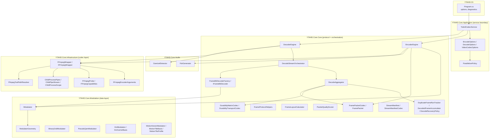
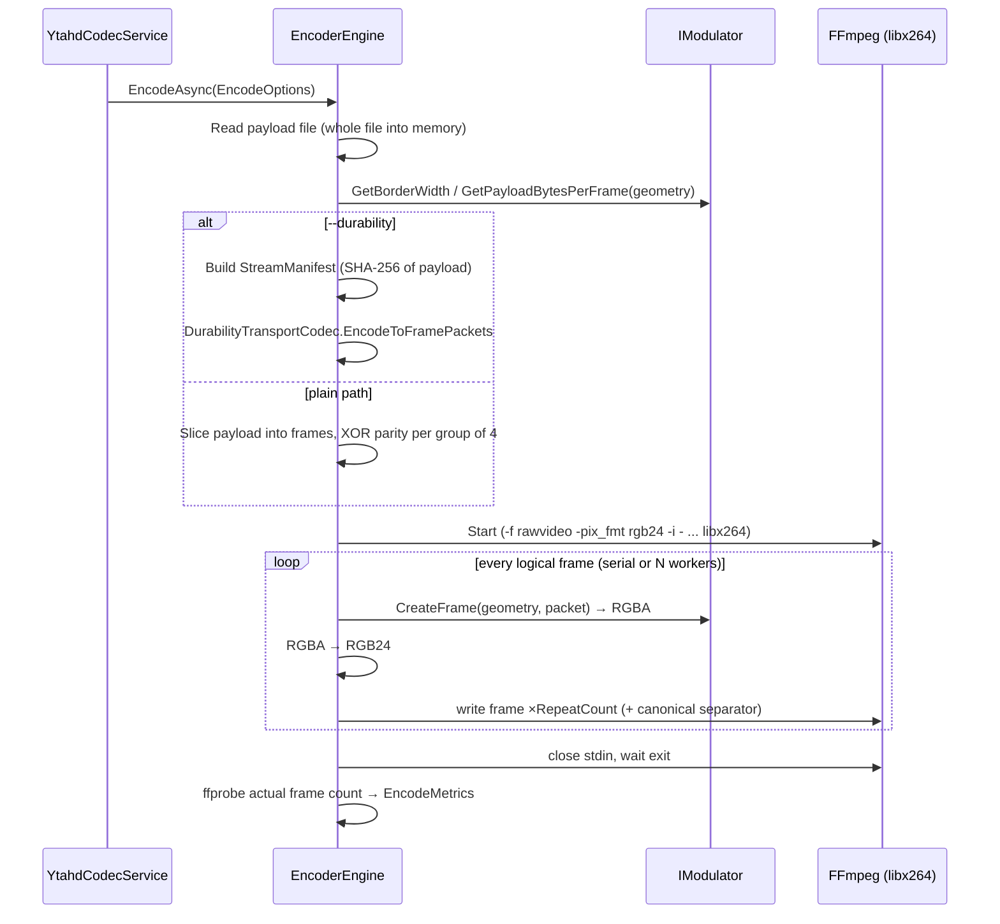
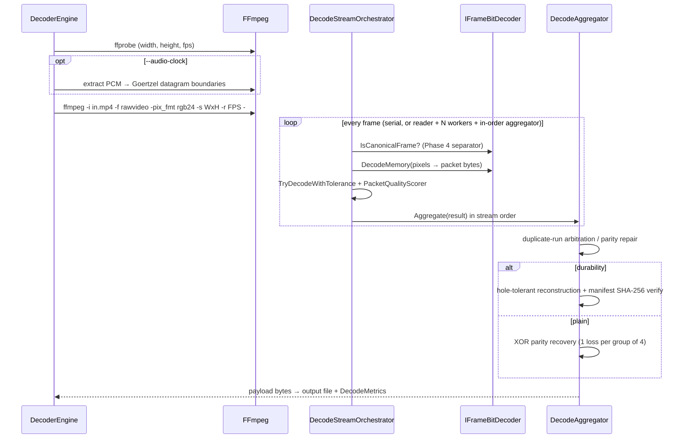
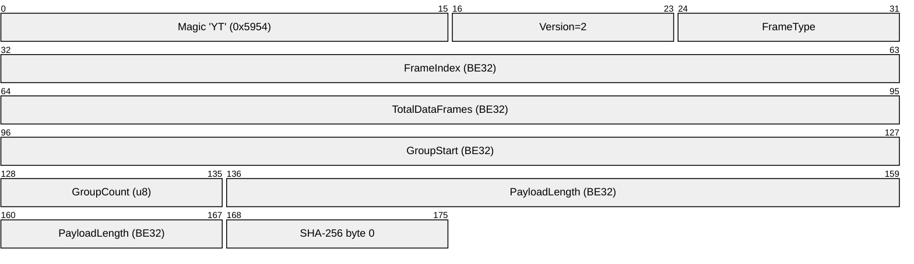
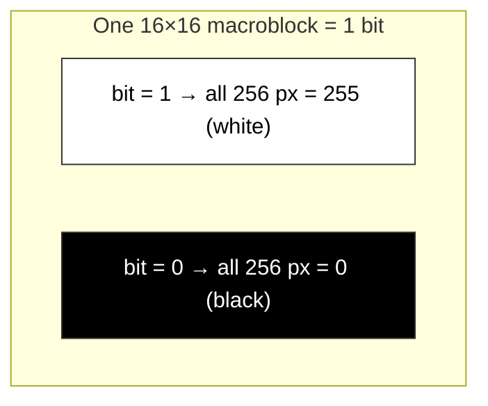
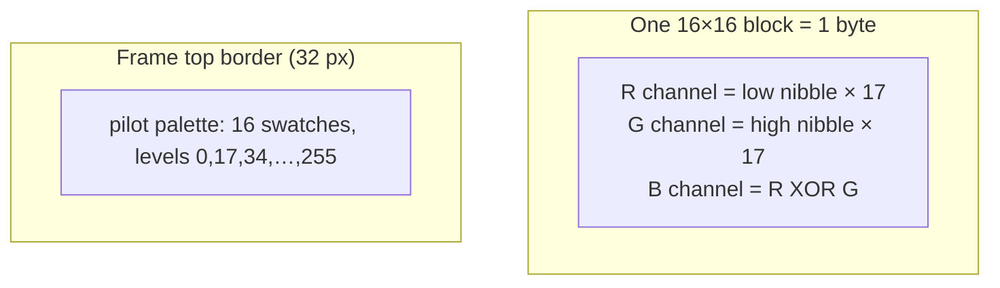
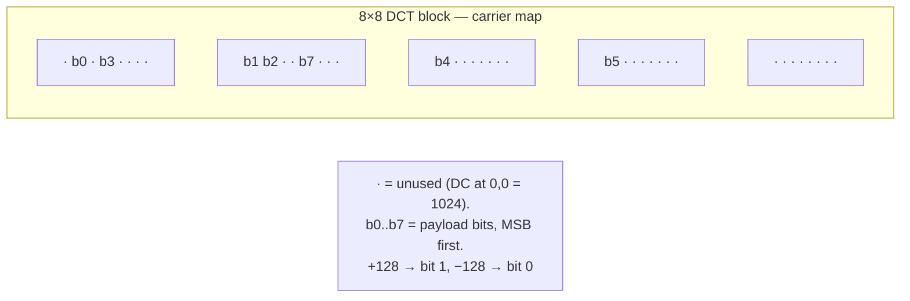
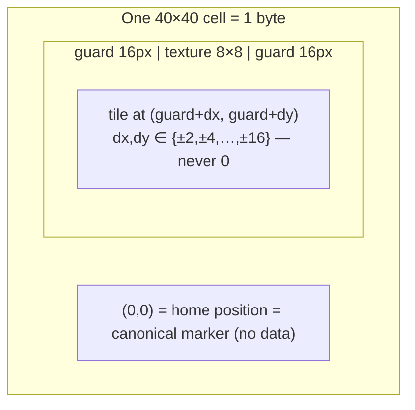
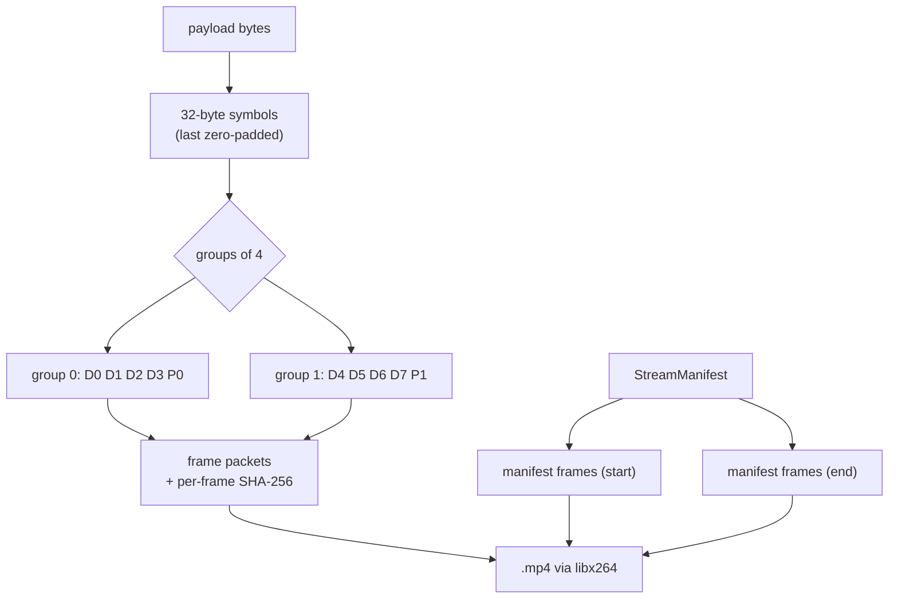

# ARCHITECTURE — YTAHD System & Wire-Format Specification

**Date:** 2026-09-14 **Status:** Current (describes the code as of 2026-09-14)
**Scope:** Full system architecture, all modulation ("compression") algorithms with the
math behind them, and a byte-exact wire-format specification sufficient for a third party
to write an independent decoder.

> **How to read this document.** Sections 1–4 describe the system and its data flow.
> Sections 5–8 are the **wire-format specification**: byte offsets, bit order, and the
> math of every modulation scheme. Section 9 is the audio FSK clock and Section 10 the
> decoder's tolerance contract. Section 12 is the extension guide — how to add a new
> modulator or a new protocol version without breaking existing decoders. Every constant
> stated here is verified against the source file cited next to it; when code and this
> document disagree, the code wins and this document must be updated in the same commit.

---

## Table of contents

1. [System overview](#1-system-overview)
2. [Layer architecture](#2-layer-architecture)
3. [Encode pipeline](#3-encode-pipeline)
4. [Decode pipeline](#4-decode-pipeline)
5. [Frame packet wire format (byte-exact)](#5-frame-packet-wire-format-byte-exact)
6. [Stream manifest wire format (byte-exact)](#6-stream-manifest-wire-format-byte-exact)
7. [Modulation algorithms (Phase 1–4) — math and pixel layout](#7-modulation-algorithms-phase-14--math-and-pixel-layout)
8. [Durability layer — parity, recovery, integrity](#8-durability-layer--parity-recovery-integrity)
9. [Audio FSK datagram clock](#9-audio-fsk-datagram-clock)
10. [Decoder tolerance contract](#10-decoder-tolerance-contract)
11. [Parallelism model](#11-parallelism-model)
12. [Extension guide](#12-extension-guide)
13. [Known limitations & open items](#13-known-limitations--open-items)

---

## 1. System overview

YTAHD transports arbitrary binary data through a **lossy** H.264 video. The payload is
sliced into framed packets, each packet is _painted_ into raw RGBA frames by a modulator
strategy, and the frame stream is piped into a real FFmpeg process (`libx264`, CRF 23)
that produces a normal `.mp4`. Decoding runs FFmpeg in reverse (raw RGB24 out), scores
every frame's pixels back into bytes, validates each packet's SHA-256, and reassembles
the payload — tolerating drift, duplicated frames, and lost frames.

The single standing constraint: **H.264 output is never bit-perfect.** Every design
decision below exists because of that. The decoder never assumes a pixel value survived;
it scores candidates, verifies hashes, and repairs from parity.

```mermaid
flowchart LR
    subgraph Encode
        A[Input file<br/>arbitrary bytes] --> B[Frame packet codec<br/>header + SHA-256]
        B --> C[Durability layer<br/>XOR parity + manifest]
        C --> D[Modulator<br/>Phase 1-4]
        D --> E[RGBA → RGB24]
        E --> F[FFmpeg stdin<br/>rawvideo pipe]
        F --> G[libx264 CRF 23<br/>.mp4 + optional AAC]
    end
    subgraph Decode
        H[.mp4] --> I[FFmpeg stdout<br/>rawvideo rgb24]
        I --> J[Frame-bit decoder<br/>pixels → bytes]
        J --> K[Packet validation<br/>magic + SHA-256]
        K --> L[Aggregator<br/>dedupe + parity repair]
        L --> M[Durability reconstruction<br/>+ manifest verify]
        M --> N[Output file]
    end
    G -. file transfer .-> H
```



### 1.1 Projects

| Project       | Role                                                                           |
| ------------- | ------------------------------------------------------------------------------ |
| `YTAHD.Core`  | All protocol, modulation, durability, FFmpeg infrastructure. The only library. |
| `YTAHD.Cli`   | Command-line host (`encode` / `decode`), option parsing, diagnostics output.   |
| `YTAHD.Tests` | xUnit suite: unit tests + real-FFmpeg round-trip regression tests.             |
| `YTAHD.Perf`  | Benchmark harness for throughput/parallelism measurements.                     |
| `probe/`      | Minimal real-FFmpeg smoke-test utility.                                        |

### 1.2 The two-layer contract

The system is split exactly in two, and the boundary is load-bearing:

- **Codec layer (FFmpeg)** — moves pixels through a lossy codec. Knows nothing about
  payloads. Owned by `YTAHD.Core.Infrastructure` (`FFmpegWrapper`, `FFmpegEncoderArguments`,
  `FFmpegProbe`, `ChildProcessPipes`).
- **Data layer (modulation)** — maps bytes onto pixels and back. Knows nothing about
  codecs; it only ever sees raw RGBA/RGB buffers. Owned by `YTAHD.Core.Modulation`
  (`IModulator` implementations) and `YTAHD.Core.Core` (packet codec, engines, durability).

`YTAHD.Core.Application` (`YtahdCodecService`, `EncodeOptions`, `DecodeOptions`,
`VideoCodecOptions`) is the public service boundary. Consumers should never reach past it
into engines or infrastructure.

---

## 2. Layer architecture



### 2.1 Key abstractions

| Abstraction                | File                                        | Contract                                                                                                                                                                    |
| -------------------------- | ------------------------------------------- | --------------------------------------------------------------------------------------------------------------------------------------------------------------------------- |
| `IModulator`               | `YTAHD.Core/Modulation/IModulator.cs`       | Maps payload bytes ↔ pixels. Reports geometry (payload capacity, packet buffer length, border width) and renders/decodes frames.                                            |
| `IFrameBitDecoder`         | `YTAHD.Core/Core/FrameBitDecoderFactory.cs` | The decode-side twin of a modulator: pixels → packet bytes, plus an optional `IsCanonicalFrame` classifier.                                                                 |
| `IFrameBitDecoderProvider` | `IModulator.cs`                             | Capability interface: a modulator supplies its own decoder. New modulators implement this; the legacy type ladder in `FrameBitDecoderFactory` is a migration fallback only. |
| `IFrameEmissionStrategy`   | `Modulation/IFrameEmissionStrategy.cs`      | Optional: custom physical-frame emission (repeats + canonical separator). Default is a fixed 3× repeat per logical frame.                                                   |
| `IParallelismConfigurable` | `Modulation/InnerLoopParallelism.cs`        | Optional: modulator/decoder inner-loop worker count, split from the frame-level budget by `ParallelismPolicy.ResolveInnerDegree`.                                           |
| `IModulatorDecorator`      | `IModulator.cs`                             | Wrapper forwarding to an inner modulator; decoder resolution unwraps it.                                                                                                    |
| `ModulatorGeometry`        | `Modulation/ModulatorGeometry.cs`           | Value object: `Width`, `Height`, `MacroblockSize`, `HeaderBytes`, `BorderWidth`, `BitsPerFrame`. Geometry is **protocol state** — encoder and decoder must agree on it.     |
| `VideoCodecOptions`        | `Application/VideoCodecOptions.cs`          | Shared encode/decode configuration (dimensions, fps, macroblock size, durability, audio clock, parallelism, encoder/hwaccel selection).                                     |

---

## 3. Encode pipeline

Entry: `YtahdCodecService.EncodeAsync` → `EncoderEngine.EncodeAsync`
(`YTAHD.Core/Core/EncoderEngine.cs`).



### 3.1 Frame emission (physical vs logical frames)

One **logical frame** = one packet (data, parity, or manifest chunk). It becomes several
**physical video frames**:

| Modulator                          | Physical frames per logical frame         | Source                                             |
| ---------------------------------- | ----------------------------------------- | -------------------------------------------------- |
| Default (Phase 1–3)                | 3 identical repeats                       | `EncoderEngine` default `repeatCount = 3`          |
| Phase 4 (`IFrameEmissionStrategy`) | 1 displaced frame + 1 canonical separator | `RepeatCount = 1`, `UsesCanonicalSeparator = true` |

The 3× repeat is the plain path's loss insurance: H.264 may corrupt any single physical
frame, and the decoder's duplicate-run tracker (§10.3) keeps the best-quality copy.
Phase 4 replaces repetition with a canonical "no data" frame that marks the datagram
boundary, enabling single-frame decode.

### 3.2 Plain-path packet schedule (no `--durability`)

`EncoderEngine.EnumerateFramePackets`: payload is sliced into `payloadBytesPerFrame`
chunks; frames are grouped **4 data frames per parity group** (`DataFramesPerParityGroup = 4`);
after each group one parity frame is emitted whose payload is the byte-wise XOR of the
group's data payloads (zero-padded to `payloadBytesPerFrame`). Stream order is therefore:

```
[D0 D1 D2 D3 P0] [D4 D5 D6 D7 P1] ...
```

### 3.3 Durability-path packet schedule (`--durability`)

`DurabilityTransportCodec.EncodeToFramePackets` (§8) emits:

```
[manifest chunks (start copy)] [D0..Dn-1 grouped, parity per group] [manifest chunks (end copy)]
```

### 3.4 The exact FFmpeg encode command

Built in `FFmpegWrapper.StartAsync` (`YTAHD.Core/Infrastructure/FFmpegWrapper.cs`):

```
ffmpeg -nostdin -y -f rawvideo -pix_fmt rgb24 -s {W}x{H} -r {FPS} -i -
       -c:v libx264 -crf 23 -pix_fmt yuv420p -an "{output}.mp4"
```

With `--audio-clock` a second input is added (raw PCM file, mono 16-bit 44100 Hz):

```
ffmpeg -nostdin -y -f rawvideo -pix_fmt rgb24 -s {W}x{H} -r {FPS} -i -
       -f s16le -ar 44100 -ac 1 -i "{pcm}.raw"
       -c:v libx264 -crf 23 -pix_fmt yuv420p -c:a aac -strict -2 -shortest "{output}.mp4"
```

Encoder selection (`FFmpegEncoderArguments.For`):

| `--video-encoder`           | Arguments                                                            |
| --------------------------- | -------------------------------------------------------------------- |
| `libx264` (default)         | `-c:v libx264 -crf 23 -pix_fmt yuv420p`                              |
| `h264_qsv`                  | `-c:v h264_qsv -global_quality 23 -pix_fmt yuv420p`                  |
| `h264_nvenc` (experimental) | `-c:v h264_nvenc -preset p4 -cq 23 -pix_fmt yuv420p`                 |
| `h264_amf` (experimental)   | `-c:v h264_amf -quality balanced -qp_i 23 -qp_p 23 -pix_fmt yuv420p` |

`ffmpeg` is resolved from `PATH` by default; `--ffmpeg-path` accepts an explicit
executable path **or** a directory (`FfmpegToolPathResolver`).

---

## 4. Decode pipeline

Entry: `YtahdCodecService.DecodeAsync` → `DecoderEngine.DecodeAsync` →
`DecodeStreamOrchestrator.ProcessAsync` → `DecodeAggregator`.



### 4.1 The exact FFmpeg decode command

`DecoderEngine.BuildDecodeArguments`:

```
ffmpeg -nostdin -hide_banner -loglevel error [-hwaccel {qsv|cuda|d3d11va} -hwaccel_output_format nv12]
       -i "{input}.mp4" -f rawvideo -pix_fmt rgb24 -s {W}x{H} -r {FPS} -
```

Frame dimensions and fps are probed with `ffprobe` first and override the configured
defaults, so a video encoded at any resolution decodes correctly without flags.

---

## 5. Frame packet wire format (byte-exact)

This is the packet that gets modulated into one logical frame. Defined in
`YTAHD.Core/Core/FramePacket.cs` and `FramePacketCodec.cs`. All multi-byte integers are
**big-endian**. Two versions exist on the wire; decoders must accept both.

### 5.1 Version 2 (current) — 53-byte header

```
offset  size  field
------  ----  -------------------------------------------------------------
0       2     Magic          = 0x59 0x54 ('Y','T') — big-endian 0x5954
2       1     Version        = 2
3       1     FrameType      = 0 (data) | 1 (parity) | 2 (manifest chunk)
4       4     FrameIndex     uint32 BE — data frame ordinal (0-based)
                             (manifest: chunk index)
8       4     TotalDataFrames uint32 BE — total data frames in the stream
                             (manifest: total data frames, not chunk count)
12      4     GroupStart     uint32 BE — first frame index of the parity group
                             (manifest: 0)
16      1     GroupCount     uint8 — data frames in this parity group
                             (manifest: total chunk count)
17      4     PayloadLength  uint32 BE — meaningful payload bytes that follow
21      32    Payload SHA-256 — SHA-256 over payload[0..PayloadLength)
53      ...   Payload        — exactly PayloadLength bytes
                             (the frame may be zero-padded up to the modulator's
                              per-frame capacity; padding is NOT hashed)
```

### 5.2 Version 1 (legacy) — 51-byte header

Identical except `PayloadLength` is `uint16 BE` at offset 17 (max 65535) and the hash
sits at offset 19:

```
17      2     PayloadLength  uint16 BE
19      32    Payload SHA-256
51      ...   Payload
```

Legacy v1 frames additionally support **wrapped-length recovery**
(`FramePacketCodec.ResolveLegacyPayloadLength`): if the declared length fails the hash,
the decoder retries candidate lengths in 65536-byte steps up to the frame capacity —
this recovers packets whose 16-bit length field wrapped.

### 5.3 Validation rules (authoritative decode gate)

`FramePacketCodec.TryDecode` accepts a packet iff **all** hold:

1. `packet.Length ≥ header size` for the declared version;
2. `magic == 0x5954` and `version ∈ {1, 2}`;
3. `frameType ∈ {0, 1, 2}`;
4. `totalDataFrames > 0`, `groupStart ≥ 0`, `groupCount > 0`,
   `0 ≤ payloadLength ≤ packet.Length − headerBytes`;
5. `SHA-256(payload[0..payloadLength)) == header hash` — **strict per-frame integrity**
   (ADR CR-20260912-05 stage 1). A hash mismatch means the packet is _corrupt_, not
   merely weak, and it is rejected before accumulation.

### 5.4 Bit-level example

A v2 data frame carrying the 4-byte payload `DE AD BE EF`, frame 7 of 100, group
starting at frame 4 with 4 frames:

```
59 54 02 00 00 00 00 07  00 00 00 64  00 00 00 04  04  00 00 00 04
│  │  │  │              │             │              │   │
│  │  │  └ frameIndex=7  └ total=100  └ groupStart=4 └   └ payloadLen=4
│  │  └ version=2
│  └ 'T'
└ 'Y'
<32-byte SHA-256 of DE AD BE EF> DE AD BE EF
```

### 5.5 Header layout diagram



_(the SHA-256 continues for another 31 bytes; the diagram shows the first)_

---

## 6. Stream manifest wire format (byte-exact)

The manifest (ADR CR-20260912-05) rides in `FrameType = 2` frames and proves
whole-payload integrity. Serialized by `StreamManifestCodec` — all integers here are
**little-endian** (unlike the frame header). Fixed part is 74 bytes:

```
offset  size  field
------  ----  ----------------------------------------------------------------
0       1     Version          = 1
1       8     TotalPayloadBytes int64 LE — exact original payload size
9       32    PayloadSha256    — SHA-256 over the FULL original payload
41      4     ModulatorIdLen   int32 LE — byte length of the UTF-8 id
45      N     ModulatorId      UTF-8 (e.g. "DctModulator")
45+N    4     Width            int32 LE
49+N    4     Height           int32 LE
53+N    4     MacroblockSize   int32 LE
57+N    4     Fps              int32 LE
61+N    4     DataFrameCount   int32 LE (data frames, excluding parity/manifest)
65+N    4     ParityGroupSize  int32 LE (0 = durability off)
69+N    4     ParitySymbolsPerGroup int32 LE
73+N    1     UseDurabilityMatrix byte (0/1)
```

Emission: the serialized manifest is split into chunks that each fit one frame's payload
capacity; `chunkIndex` rides in `FrameIndex`, `chunkCount` in `GroupCount`. A
single-chunk manifest is byte-identical to the pre-chunking format. Two redundant copies
are emitted — one before all data frames, one after — each protected by the frame
header's SHA-256. At decode, conflicting copies fail the decode; a recovered manifest is
the authority for expected length and whole-payload hash.

---

## 7. Modulation algorithms (Phase 1–4) — math and pixel layout

All modulators work on **grayscale-valued RGB** (R = G = B; alpha = 255). The encoder
renders RGBA, converts to RGB24, and FFmpeg converts to YUV420P — the lossy step. All
decoders read back luminance as `(R + G + B) / 3` per pixel, which tolerates chroma
subsampling drift.

Capacity formula shared by all phases (`FrameLayoutCalculator`):

$$
\text{blocksX} = \left\lfloor \frac{W - 2 \cdot B}{m} \right\rfloor,\quad
\text{blocksY} = \left\lfloor \frac{H - 2 \cdot B}{m} \right\rfloor
$$

$$
C_{\text{frame}} = \max\!\left(0,\ \left\lfloor \frac{\text{blocksX} \cdot \text{blocksY} \cdot s - 8 \cdot H_b}{8} \right\rfloor\right)\ \text{bytes}
$$

where $B$ = border width, $m$ = block/cell size, $s$ = payload **bits** per block
(1 for Phase 1, 8 for Phases 2–4), $H_b$ = header bytes (53). Worked examples at
3840×2160: Phase 1 → $(240 \cdot 135 - 424)/8 = 3{,}997$ bytes/frame; Phase 3 →
$472 \cdot 262 - 53 = 123{,}611$ bytes/frame.

### 7.1 Phase 1 — Binary grid (1 bit per macroblock)

**Files:** `BinaryGridModulator.cs`, `BinaryGridFrameBitDecoder.cs`. Border: **0**.
Block: 16×16 px (configurable). **1 bit per block.**

**Encode.** Payload bits are read MSB-first: bit $i$ of the stream is
`payload[i / 8] >> (7 - i % 8) & 1`. Block $(b_x, b_y)$ (row-major, $b_y$ outer) carries
bit $i = b_y \cdot \text{blocksX} + b_x$ and is painted uniformly:

$$
\text{pixel}(x,y) = \begin{cases} 255 & \text{bit} = 1 \\ 0 & \text{bit} = 0 \end{cases}
\qquad x \in [b_x m,\ (b_x{+}1)m),\ y \in [b_y m,\ (b_y{+}1)m)
$$

**Decode.** Each block's mean luminance $\bar{L}$ is computed; a candidate threshold $t$
classifies $\bar{L} \ge t \Rightarrow 1$. The decoder does **not** trust a single
threshold: it builds candidates (fixed ladder 0…255 in steps of 16, plus the block
luminance median, mean, min, max) and scores each resulting packet (§10.4), keeping the
best. This is the core defense against H.264 lifting blacks and crushing whites.



Frame layout (row-major bit order, MSB first within each byte):

```
┌──────────────────────────────────────────┐
│ block(0,0)=b7  block(1,0)=b6  block(2,0)=b5 ...   ← byte 0
│ block(0,1)=b15 block(1,1)=b14 ...                 ← byte 1
│ ...                                       │
└──────────────────────────────────────────┘
```

### 7.2 Phase 2 — Pseudo-QAM (16-level PAM per channel, 1 byte per block)

**Files:** `PseudoQamModulator.cs`, `PseudoQamFrameBitDecoder.cs`. Border: **32 px**,
painted with a calibration pattern + pilot palette. Block: 16×16 px. **1 byte per block.**

**Math.** Each byte $v$ splits into nibbles $\text{lo} = v \mathbin{\&} \text{0x0F}$,
$\text{hi} = v \gg 4$. Each nibble $n \in [0,15]$ maps to a 16-level pulse-amplitude
modulation value with step $S = 17$ (since $15 \times 17 = 255$):

$$
R = \text{lo} \cdot 17,\qquad G = \text{hi} \cdot 17,\qquad B = R \oplus G\ \ (\text{XOR parity})
$$

The blue channel carries $R \oplus G$ as a built-in per-symbol parity check; the current
decoder recovers from R and G only and reserves B for calibration/parity.

**Decode.** Dequantization rounds to the nearest grid level:

$$
n = \mathrm{clamp}\!\left(\left\lfloor \frac{p + \lfloor S/2 \rfloor}{S} \right\rfloor,\ 0,\ 15\right)
= \mathrm{clamp}\!\left(\left\lfloor \frac{p + 8}{17} \right\rfloor,\ 0,\ 15\right)
$$

i.e. each level's decision region is $\pm 8$ around the ideal value — the tolerance budget
against H.264 quantization noise. Byte recovered: $v = (\text{hi} \ll 4) \mid \text{lo}$,
sampled at each block's **center pixel**.

**Calibration border.** The 32-px border paints, per border pixel column group
($\text{index} = \lfloor x / B \rfloor \bmod 16$, level $= \text{index} \cdot 17$):
$R = \text{level}$, $G = 255 - \text{level}$, $B = \text{level} \oplus \text{0x55}$.
The top border additionally paints a 16-swatch **pilot palette** (one swatch per level,
4 px apart, starting at $x = B + 4$, $y = B/2$) so a decoder can estimate the channel
response curve after transcoding (`EstimateCalibrationProfile`).



### 7.3 Phase 3 — DCT carrier (1 byte per 8×8 block)

**Files:** `DctModulator.cs`, `DctCarrierBasis.cs`, `DctFrameBitDecoder.cs`.
Border: **32 px neutral gray (128)**. Block: 8×8 px. **1 byte per block** (8 bits → 8
carrier coefficients).

**Math.** Use the orthonormal 2-D DCT-II with normalization $C(k) = 1/\sqrt{2}$ for
$k=0$, else $1$, and the $1/4$ scale of the 8-point basis:

$$
F(u,v) = \frac{C(u)\,C(v)}{4} \sum_{x=0}^{7}\sum_{y=0}^{7} f(x,y)\,
\cos\!\frac{(2x+1)u\pi}{16}\,\cos\!\frac{(2y+1)v\pi}{16}
$$

The 8 **carrier positions** (lowest AC frequencies, ordered by $u{+}v$ ascending):

| #   | (u,v) | #   | (u,v) |
| --- | ----- | --- | ----- |
| 0   | (0,1) | 4   | (2,0) |
| 1   | (1,0) | 5   | (0,3) |
| 2   | (1,1) | 6   | (3,0) |
| 3   | (0,2) | 7   | (1,2) |

Each payload bit $b_i \in \{0,1\}$ sets its carrier coefficient to
$(-1)^{1-b_i} \cdot A$ with amplitude $A = 128$; the DC coefficient is fixed at
$F(0,0) = 1024$, which under the orthonormal IDCT contributes
$\frac{C(0)^2}{4} \cdot 1024 = 128$ — the mean pixel value. The inverse transform:

$$
f(x,y) = 128 + \frac{1}{4}\sum_{(u,v)\,\in\,\text{carriers}} C(u)C(v)\,c_{u,v}\,
\cos\!\frac{(2x+1)u\pi}{16}\,\cos\!\frac{(2y+1)v\pi}{16}
$$

with $c_{u,v} = +128$ for bit 1, $-128$ for bit 0, clamped to $[0,255]$. The result is a
smooth low-frequency gradient — exactly the content H.264 preserves best at CRF 23
(pixel-domain wave height ≈ ±18–32 luma units, well above CRF-23 quantization noise for
smooth blocks).

**Decode.** Forward DCT per block on mean luminance; bit $= 1$ iff $F(u,v) > 0$. The DC
mean contributes zero to every AC coefficient by orthogonality, so no bias correction is
needed. Bit order within the block: carrier 0 is the MSB of the block's byte.



### 7.4 Phase 4 — Motion-vector carrier (1 byte per 40×40 cell)

**Files:** `MotionVectorModulator.cs`, `MotionTileBasis.cs`, `MotionTileProfile.cs`,
`MotionFrameBitDecoder.cs`. Border: **32 px**. Cell: **40×40 px** = 8×8 texture + 16 px
guard margin on every side. **1 byte per cell.**

**Math.** Each byte $v$ splits into axis codes
$\text{dx}_c = (v \gg 4) \mathbin{\&} \text{0xF}$, $\text{dy}_c = v \mathbin{\&} \text{0xF}$.
Each 4-bit code maps to a **non-zero even pixel offset** (step 2 px, 16 levels):

$$
\text{offset}(c) = \begin{cases}
-2\,(8 - c) & c \in [0,7] \quad\rightarrow\ -16,-14,\dots,-2 \\
+2\,(c - 7) & c \in [8,15] \quad\rightarrow\ +2,+4,\dots,+16
\end{cases}
$$

The tile texture (8×8 px) is drawn at `cellOrigin + guard + (dx, dy)`. Because no axis
offset is ever 0, the combination $(0,0)$ is impossible for data and is **reserved as the
canonical / no-data marker** — every tile at its home position means "separator frame".

**Reference texture.** Both sides regenerate the same 8×8 texture deterministically —
no side channel. Algorithm (`MotionTileBasis.BuildTexture`):

1. xorshift32 PRNG seeded with the protocol constant `0x59544148` (`'YTAH'`):
   $s \mathrel{\^}= s \ll 13;\ s \mathrel{\^}= s \gg 17;\ s \mathrel{\^}= s \ll 5$;
   values mapped to $[-1, 1]$.
2. Two passes of 3×3 box blur (edge-clamped) — band-limits the noise so a lossy codec
   preserves it.
3. Normalize to $[-1,1]$ and scale around luma 128 with amplitude 48:
   $\text{px} = 128 + \hat{v} \cdot 48$, clamped to $[0,255]$.

**Decode.** Full search over the finite alphabet: for each cell, every $(\text{dx},
\text{dy})$ candidate is scored by sum of absolute differences against the reference
texture over the 8×8 window:

$$
\text{SAD}(dx,dy) = \sum_{p=0}^{7}\sum_{q=0}^{7} \left| I\!\left(x_g{+}dx{+}p,\ y_g{+}dy{+}q\right) - T(p,q) \right|
$$

The argmin wins; the winning $(dx,dy)$ is mapped back through the offset table to the
byte. Canonical classification (§10.2) checks whether the **home** position beats every
data offset for ≥ 90 % of cells.



**Emission.** Phase 4 emits 1 displaced frame + 1 canonical separator per logical frame
(`IFrameEmissionStrategy`), so datagram boundaries are explicit and each datagram is
decoded from a single frame.

### 7.5 Phase comparison

|                                     | Phase 1                  | Phase 2                      | Phase 3                  | Phase 4                   |
| ----------------------------------- | ------------------------ | ---------------------------- | ------------------------ | ------------------------- |
| Unit                                | 1 bit / 16×16 block      | 1 byte / 16×16 block         | 1 byte / 8×8 block       | 1 byte / 40×40 cell       |
| Carrier                             | binary luma              | 16-PAM on R,G                | DCT AC sign              | tile displacement         |
| Border                              | 0 px                     | 32 px + pilot palette        | 32 px gray               | 32 px gray                |
| Loss robustness                     | high (threshold scoring) | medium (±8 decision regions) | high (low-freq carriers) | high (SAD search)         |
| Relative capacity @4K (bytes/frame) | 1× (4,050)               | ~7.6× (30,863)               | ~30.5× (123,611)         | ~1.2× (4,893)             |
| Physical frames / logical           | 3                        | 3                            | 3                        | 2 (displaced + canonical) |

---

## 8. Durability layer — parity, recovery, integrity

Two redundancy systems exist. The **plain path** parity is built into the engine; the
**durability matrix** (`--durability`) is the supported path for large payloads
(see §13).

### 8.1 Plain-path XOR parity

Groups of 4 data frames; one parity frame per group; payload = byte-wise XOR of the
group's data payloads, zero-padded to `payloadBytesPerFrame`. Recovery
(`DecodedFrameAccumulator.RecoverMissingPayloadFrames`):

$$
D_{\text{missing}} = P \oplus \bigoplus_{i \ne \text{missing}} D_i
$$

Exactly **one** missing frame per group is recoverable; two or more throws
(`InvalidDataException`). The last frame's recovered length is trimmed to
`expectedOutputBytes − payloadBytesPerFrame × (totalDataFrames − 1)` so trailing padding
never leaks into the output.

### 8.2 Durability matrix (`--durability`)

**Files:** `DurabilityMatrixCodec.cs`, `DurabilityTransportCodec.cs`,
`DurabilityMatrixOptions.cs`, `DurabilitySymbol.cs`. CLI defaults (ADR F-20260914-01):
`SymbolSize = 32`, `GroupSize = 4`, `ParitySymbolsPerGroup = 1`.

**Encode.** The payload is cut into fixed 32-byte **symbols** (last symbol zero-padded,
true length in `SourceLength`). Symbols are grouped (`GroupSize` per group); each group
gets one XOR parity symbol over its members:

$$
P_g[i] = \bigoplus_{s \in g} D_s[i]
$$

Every symbol is wrapped in a frame packet, so it inherits the header SHA-256; the
transport codec additionally computes `SHA256.HashData` per symbol
(`DurabilitySymbol.HasValidHash`). A `StreamManifest` (§6) is emitted twice (start/end).

**Decode.** `DurabilityTransportCodec.TryDecodeFramePacketsWithHoles`:

1. Parse every packet; keep the best copy per `(GroupId, SymbolId, IsParity)` key by
   `DurabilitySymbol.GetQualityScore` (hash-valid: 100 + 2·len + 80 data/40 parity +
   25·redundancy + group/symbol tiebreakers; 0 if the hash fails).
2. Per group: if all data symbols present → done. If 1..`ParitySymbolsPerGroup` missing →
   XOR-reconstruct each from parity + survivors. If more are missing than the parity
   budget → the **whole group becomes a zero-filled hole** and its id is recorded in the
   loss map instead of failing the decode (ADR CR-20260913-02).
3. Concatenate groups in order, trim to the manifest's `TotalPayloadBytes`.
4. Verify `SHA-256(output) == manifest.PayloadSha256` → integrity `passed` / `failed`.
   A failed verification still returns the bytes plus the loss map so callers can inspect
   what was recovered; the CLI surfaces it loudly.



### 8.3 Integrity statuses

| Status       | Meaning                                                                                  |
| ------------ | ---------------------------------------------------------------------------------------- |
| `passed`     | Output length and SHA-256 match the manifest.                                            |
| `failed`     | Output reconstructed but hash/length mismatch (holes or corruption); loss map available. |
| `frame-only` | No manifest recovered; per-frame hashes validated only (plain path).                     |

---

## 9. Audio FSK datagram clock

**Files:** `FskGenerator.cs`, `GoertzelDetector.cs` (ADR F-20260903-02). Optional
(`--audio-clock`); videos without audio decode identically.

**Synthesis.** Mono 16-bit PCM at 44100 Hz, amplitude 12000 (headroom below full scale).
A continuous **hold tone at 1000 Hz**; at each datagram start a **pulse at 1500 Hz**
spanning 2 video frames (an AAC frame is 1024 samples ≈ 23 ms > one 60 fps frame ≈ 735
samples, so a 1-frame pulse cannot survive re-encoding sample-accurately). Phase is
continuous across segments; every segment edge gets a 3 ms linear fade-in/out
(envelope $e(i) = i / N_{\text{ramp}}$) so frequency switches never click.

**Detection.** Per video-frame window ($\text{window} = 44100 / \text{fps}$ samples),
two-bin Goertzel magnitude:

$$
\omega = \frac{2\pi f}{F_s},\quad c = 2\cos\omega,\quad
q_0 = c\,q_1 - q_2 + x[n],\ \ q_2 \leftarrow q_1,\ q_1 \leftarrow q_0
$$

$$
|X(f)| = \sqrt{q_1^2 + q_2^2 - q_1 q_2 c}
$$

Window is "pulse" iff $|X(1500)| > |X(1000)|$ — a **frequency-ratio** decision, immune to
loudness normalization. A rising hold→pulse edge marks a datagram boundary; adjacent
pulse windows merge into one boundary. The boundary count cross-checks the decoded video
frame count (observability only; it never gates output).

---

## 10. Decoder tolerance contract

The decoder's behavior under lossy corruption is protocol. An independent decoder must
match these semantics.

### 10.1 Packet-level tolerance

`FramePacketCodec.TryDecodeWithTolerance` layers three attempts over strict decode:

1. **Strict decode** (§5.3).
2. **Common-shift normalization** (`TryNormalizeWithTolerance`): estimates a single
   additive luminance offset from the first 8 header bytes
   ($\text{shift} = \operatorname{round}(\frac{1}{8}\sum_{i<8}(\text{got}_i - \text{want}_i))$),
   subtracts it from every byte, retries. This rescues packets whose DC level drifted.
3. **Magic repair**: if bytes 0–1 are within ±16 of `'Y','T'` and the version byte is
   within ±4 of a known version, snap the magic bytes and retry.

A packet that only passes via tolerance is "weak" but usable; the strict hash check
still gates acceptance.

### 10.2 Canonical frames (Phase 4)

`MotionFrameBitDecoder.IsCanonicalFrame`: per cell, the home position must beat every
alphabet data offset in SAD; the frame is canonical when ≥ 90 % of cells are
home-dominant. Canonical frames are datagram separators — they are skipped, never
counted as invalid packets, and they flush any pending duplicate run.

### 10.3 Duplicate-run arbitration

H.264 encodes the 3 identical repeats of a logical frame into similar-but-not-identical
physical frames. `DuplicateFrameRunTracker` groups consecutive frames with equal
**logical signatures** (the full decoded packet bytes) and keeps the copy with the best
`PacketQualityScorer` score. When the run ends, the run length is divided by the
emission repeat count (3, rounded) to recover the logical frame count, and the best
physical copy is decoded that many times into the accumulator.

### 10.4 Packet quality scoring

`PacketQualityScorer.Score` — used to pick the best duplicate and to gate validity:

```
score  = 1000
       + payloadLength × 8
       + 64 (data) | 32 (parity)
       + totalDataFrames × 2
       + nonZeroBytes × 6
       + byteTransitions × 2
```

`BinaryGridFrameBitDecoder` adds header-shape bonuses on top when selecting a threshold
candidate: +4096 for magic `'YT'`, +256 for a known version byte, +128 for a known frame
type, +128 for an in-range payload length. The threshold whose candidate scores highest
wins; ties fall back to the median-luminance threshold.

### 10.5 Early stop

`DecodeRecoveryPolicy.ShouldStopDecoding`: on the plain path, once the **contiguous
prefix** of accumulated frames (index 0,1,2,…) covers `expectedOutputBytes`, decoding
stops. Durability decodes the whole stream (manifest reconciliation needs the tail).

---

## 11. Parallelism model

`ParallelismPolicy` (ADR CR-20260912-01) resolves `--jobs`:

| Requested        | Resolved                                                            |
| ---------------- | ------------------------------------------------------------------- |
| `auto` (default) | `min(4, cores − 1)`, serial on 1–2 cores                            |
| `serial` / `1`   | 1 — fully serial path, deterministic                                |
| `0`              | 1 frame worker (sequential frames); inner loops still use all cores |
| `N > 1`          | `min(N, 64)` frame workers                                          |

The resolved count is a **stage budget split two ways**: with N frame workers the
modulator/decoder inner loops run serially; with one frame worker the inner loops use all
cores (`ParallelismPolicy.ResolveInnerDegree` = `cores / frameWorkers`, clamped to ≥ 1;
an explicit `serial` request forces the inner loops serial too). Both engines implement
the same shape:

- **Encode:** producer → N render workers → in-order writer (bounded channels,
  `SortedDictionary` reordering by frame index).
- **Decode:** reader (acquires a result slot **in sequence order** before dispatch —
  prevents a circular-wait deadlock, see `DecodeStreamOrchestrator`) → N decode workers →
  in-order aggregator feeding the single-threaded `DecodeAggregator`.

Aggregation semantics are identical on serial and parallel paths (ADR CR-20260913-03):
results are strictly ordered before `DecodeAggregator.Aggregate`, so dedupe, parity
repair, and early-stop behave the same either way.

---

## 12. Extension guide

### 12.1 Adding a new modulator (e.g. Phase 5)

1. **Create the modulator** in `YTAHD.Core/Modulation/` implementing `IModulator` and
   **`IFrameBitDecoderProvider`** (returns your decoder — do not rely on the legacy type
   ladder). If it needs custom emission, implement `IFrameEmissionStrategy`; if its inner
   loops parallelize, implement `IParallelismConfigurable`.
2. **Keep geometry in the value object.** Never add long parameter lists; extend
   `ModulatorGeometry` (or a new profile record like `MotionTileProfile`) if you need new
   constants. Geometry is protocol state — document it in this file.
3. **Create the frame-bit decoder** in `YTAHD.Core/Core/` implementing `IFrameBitDecoder`.
   Decode from mean luminance `(R+G+B)/3`; never assume exact pixel values.
4. **Register in the CLI** (`YTAHD.Cli/Program.cs`, `CreateModulator`) with a name and
   aliases.
5. **Tests** (repo rule: regression test alongside the change): unit tests for the
   modulator/decoder pair, plus a real-FFmpeg round-trip test in `YTAHD.Tests`
   (synthetic-only is not sufficient for final verification).
6. **ADR** `F-YYYYMMDD-NN-<slug>.md` in `docs/decisions/`, staged in the same commit.
7. **Update this document** (§7 table + a new §7.x) in the same commit.

### 12.2 Adding a protocol version (v3)

The header is versioned for exactly this purpose:

1. Bump `FramePacket.FrameVersion`, extend `HeaderBytes` and `GetHeaderBytes` /
   `GetHashOffset`. Decoders must keep accepting v1 and v2 — the version byte is the
   dispatch key.
2. Prefer **backward-compatible** field placement (e.g. manifest chunking reused
   `FrameIndex`/`GroupCount` rather than growing the header). If a wire-format change is
   unavoidable (e.g. the manifest copy-identity bit in `docs/BACKLOG.md`), it must ride
   the next protocol revision and get an ADR.
3. Extend `TryDecode` validation and, if needed, the tolerance ladder (§10.1).
4. Update `PacketQualityScorer` header-shape bonuses and the decoders' candidate scoring
   so old and new headers both score meaningfully.
5. Tests: cross-version compatibility (v2 encoder → v3 decoder and vice versa where the
   compatibility story allows), plus real-FFmpeg round trips.

### 12.3 Adding a durability scheme

`IDataDurabilityCodec` is the seam. A Reed–Solomon or fountain-code replacement
implements the same interface; `DurabilityMatrixOptions.RedundancyMode` already
anticipates modes beyond `XorParity`. Any new scheme must preserve: per-symbol hashes,
hole-tolerant reconstruction with a loss map, and manifest-based whole-payload
verification.

### 12.4 Versioning rules of thumb

- **Wire-visible change** (header, manifest, modulation math, geometry constants) →
  protocol version bump or new modulator id + ADR + this document updated in the same
  commit.
- **Wire-invisible change** (parallelism, metrics, CLI surface) → ordinary change + ADR
  if non-trivial.
- Never change a shipped modulator's pixel math in place — add a new phase and keep the
  old one decodable.

---

## 13. Known limitations & open items

Tracked in `docs/BACKLOG.md` (open items only) — summarized here for the architecture
picture; the backlog is authoritative:

- **Plain path is not byte-exact for long streams.** Lossy per-frame bit errors
  accumulate; 1 MB phase2 payloads have thrown, 256 KB has silently truncated. The
  durability matrix is the supported path for large payloads (ADR
  `F-20260914-03-long-stream-regression-coverage.md`).
- **Decode assembles the whole payload in memory.** Streaming, contiguous-prefix output
  is designed (ADR `F-20260914-02-streaming-decode-output.md`, Accepted) but not
  implemented.
- **Manifest copies are identified by arrival order**, not by an explicit wire bit — a
  deferred protocol change (backlog).
- **Phase 4 + audio FSK cadence conflict:** Phase 4's 2-frame datagram span leaves no
  hold gap, so only the first boundary is audio-detectable (backlog).

---

_Source-of-truth files for every constant in this document: `FramePacket.cs`,
`FramePacketCodec.cs`, `FrameLayoutCalculator.cs`, `StreamManifest.cs`,
`BinaryGridModulator.cs`, `PseudoQamModulator.cs`, `DctCarrierBasis.cs`,
`MotionTileBasis.cs`, `MotionTileProfile.cs`, `DurabilityMatrixCodec.cs`,
`DurabilityMatrixOptions.cs`, `FskGenerator.cs`, `GoertzelDetector.cs`,
`FFmpegWrapper.cs`, `FFmpegEncoderArguments.cs`, `EncoderEngine.cs`, `DecoderEngine.cs`,
`DecodeStreamOrchestrator.cs`, `DecodeAggregator.cs`, `PacketQualityScorer.cs`,
`FrameBitDecoderFactory.cs`, `ParallelismPolicy.cs`, `YTAHD.Cli/Program.cs`._
