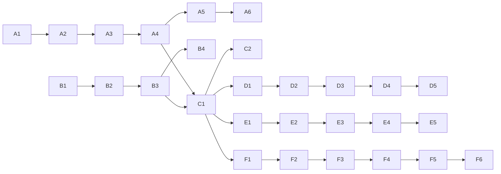

# PLAN — Phase 4 (Motion Vector Modulation) + Audio FSK Clock + GPU Acceleration + Integrity + Parallelism

**Date:** 2026-09-03 **Status:** Approved plan, not started
**Design ADRs:** `F-20260903-01-phase4-motion-vector-design.md`,
`F-20260903-02-audio-fsk-clock-design.md` (both `Accepted`; flip to `Implemented` in the
commits that land A5/B4 respectively)
**Backlog items:** `Phase 4: Motion Vector Abuse`, `Audio-assisted clock synchronization`

Two workstreams. **A (Phase 4)** and **B (FSK)** are independent until stage **C (combined
clock)**. Every stage ends with the full test suite green
(`dotnet test YTAHD.Tests/YTAHD.Tests.csproj`) and Phase 1–3 behavior unchanged. Each stage
is one commit with its ADR (`F-YYYYMMDD-NN` for A/B stages, per repo convention).

---

## Design constants (fixed unless M5/B4 measurement forces change)

| Constant          | Value                                     | Rationale                                       |
| ----------------- | ----------------------------------------- | ----------------------------------------------- |
| Tile texture size | 8×8 px baseline (4 and 16 swept in A5)    | Reliability baseline; 4×4 is density experiment |
| Offset alphabet   | 4 bits/axis, 2 px steps, `(0,0)` excluded | Above H.264 ¼-pel precision; hold-frame safe    |
| Cell size         | texture + 2×max offset (guard margin)     | Shifted tile never leaves its cell              |
| Border            | 32 px neutral gray                        | Matches Phase 3 contract                        |
| Frame emission    | canonical/displaced alternation           | Single-frame decode, duplicate-safe             |
| Texture seed      | fixed protocol constant                   | Decoder regenerates reference without side data |
| FSK frequencies   | 1000 Hz hold / 1500 Hz datagram pulse     | Survives AAC/Opus; per README                   |
| FSK pulse length  | 2 video frames (~33 ms)                   | AAC frame = 1024 samples > 1 video frame        |
| FSK detection     | 2-bin Goertzel, frequency ratio only      | Immune to loudness normalization                |

---

## Workstream A — Phase 4 modulator

### A1. Tile basis + offset alphabet

- New `YTAHD.Core/Modulation/MotionTileBasis.cs`:
  - Deterministic band-limited tile texture from a fixed seed (peaked autocorrelation,
    low high-frequency energy so the codec keeps it).
  - Offset alphabet codec: `byte ↔ (dx, dy)` (4+4 bits, 2 px steps, `(0,0)` never emitted).
- Tests: `MotionTileBasisTests` — alphabet round-trip for all 256 values, determinism,
  texture autocorrelation sharpness (self-match beats best off-by-one-step match by margin).

### A2. `MotionVectorModulator : IModulator`

- New `YTAHD.Core/Modulation/MotionVectorModulator.cs`:
  - `GetPayloadBytesPerFrame` / `GetPacketBufferLength` / `GetBorderWidth` from cell geometry.
  - `CreateFrame` renders displaced layout from payload; canonical layout for empty payload.
  - Single-tile `Encode`/`Decode` (mirrors `DctModulator`'s single-block contract).
- Tests: `MotionVectorModulatorTests` — geometry/capacity math, lossless render→decode
  round-trip, canonical-frame rendering.

### A3. `MotionFrameBitDecoder`

- New decoder in `YTAHD.Core/Core/` + registration in `FrameBitDecoderFactory`:
  - Per-tile SAD full search over the offset alphabet against the seeded reference
    (~225 candidates/tile); confidence = margin between best and second-best match.
  - Canonical-frame detection: dominant `(0,0)` best-match across tiles → "no data" signal.
- Tests: synthetic degradation before any real codec — Gaussian noise (σ up to 8), 3×3 box
  blur, ±10 luma shift; assert byte-accuracy threshold and canonical detection.

### A4. Pipeline integration

- `EncoderEngine`: replace the hard-coded `for (rep < 3)` with a modulator-driven emission
  pattern (new small interface or `IModulator` capability object: repeat count + interleaved
  canonical frames). Phase 1–3 keep the literal 3× behavior — regression-locked by tests.
- `DecoderEngine` / `DecodeStreamOrchestrator`: canonical frames terminate duplicate runs
  instead of feeding the packet path; displaced frames decode single-frame as today.
- `YTAHD.Cli/Program.cs`: `phase4` / `motion` modulator mode (encode + decode options text).
- Tests: fake-wrapper round-trip via `YtahdCodecService`, Phase 1–3 byte-identical
  regression, orchestrator canonical/displaced sequencing tests.

### A5. Real FFmpeg validation + tuning — done

- `probe` gains phase4 mode (`Program.cs`); real libx264 CRF-23 round-trip integration tests
  added to `YtahdCodecServiceTests.cs`
  (`RealFfmpeg_LargerPayloadMatrix_RoundTrips_For_Phase4`: 16/64/256-byte payloads spanning
  multiple frames and parity groups; `RealFfmpeg_MotionVectorModulator_SingleFrame_RoundTrip_DoesNotHang`).
- Exit gate met: 100% payload recovery on the real libx264 round-trip with the shipped 8×8
  texture / 2 px-step / 16 px-guard defaults, zero false invalid-packet classifications.
- **Scope decision:** the originally planned 4×4/16×16 tile-size sweep was deferred rather
  than done in this pass — it requires parameterizing `MotionTileBasis`'s currently-hardcoded
  texture-size constants across already-tested A1–A4 code, and the 8×8 baseline already
  clears the exit gate. Tracked as a follow-up tuning experiment in `docs/BACKLOG.md`, not a
  blocker. See ADR `F-20260903-01-phase4-motion-vector-design.md` (now `Status: Implemented`).

### A6. Perf + docs — done

- `YTAHD.Perf`: `phase4` capacity/overhead entry added (`CalculatePhase4PayloadBytesPerFrame`,
  mirrors `MotionVectorModulator` geometry; defaults `--repeat` to 2 for `phase4` unless the
  caller overrides it, matching the displaced+canonical emission pattern).
  README updated to implemented status with real-codec validation results. The
  "Phase 4: Motion Vector Abuse" backlog item was replaced by the (now `Implemented`) ADR;
  the deferred tile-size sweep and stage-C2 research ideas were split into their own small
  backlog follow-up items.

**Workstream A (Phase 4) complete: A1–A6 all done, 142/142 suite green throughout.**

---

## Workstream B — Audio FSK clock (independent of A until C)

**Status: complete (B1–B4), 162/162 suite green throughout.**

### B1. Real FSK synthesis — done

- `FskGenerator`: phase-continuous 16-bit PCM tone segments aligned to fps
  (`WriteHoldToneAsync`, `WritePulseAsync`), amplitude-ramped transitions.
- Tests: segment lengths, phase continuity at boundaries (no sample discontinuity),
  spectral check via Goertzel self-test.

### B2. Audio mux/demux in the FFmpeg layer — done

- `IFFmpegWrapper.StartAsync` gains an optional audio input (second pipe or temp WAV +
  `-i` + `-c:a aac`); remove `-an` only when audio is supplied.
- Decode side: extract audio track to PCM (`-vn -f s16le`); absent track → null, feature off.
- `VideoCodecOptions.UseAudioClock` (default `false`) threaded through
  `EncodeOptions`/`DecodeOptions` and CLI flag `--audio-clock`.
- Tests: fake-wrapper arg assertions; real ffmpeg smoke check that mux+extract round-trips.

### B3. Goertzel detector + pulse-to-frame alignment — done (scoped)

- New `YTAHD.Core/Audio/GoertzelDetector.cs`: 2-bin energy ratio per window,
  hysteresis, measured stream delay offset.
- `DecodeStreamOrchestrator`/`DecoderEngine`: optional audio-derived datagram count
  (`DecodeMetrics.AudioDatagramCount`) surfaced for comparison against the video-decoded
  logical frame count. **Scope note:** wiring a disagreement into actual erasure indices for
  the parity/durability layer (as originally envisioned) is deferred — see `docs/BACKLOG.md`.
- Tests: detector on synthetic noisy PCM (lowpass-smeared), the documented Phase
  4/FSK cadence conflict, orchestrator/`DecoderEngine` wiring.

### B4. Real AAC round-trip validation — done

- libx264+AAC integration test (16/64/256-byte payloads): audio-derived datagram count
  matched the video logical frame count exactly on this ffmpeg build, within the documented
  ±2 frame tolerance. `-strict -2` required for this build's experimental AAC encoder.
- Exit gate met; ADR `F-20260903-02-audio-fsk-clock-design.md` updated with findings
  (now `Status: Implemented`).

---

## Workstream C — Combined clock (after A4 + B3)

### C1. Clock arbitration — done (scoped to observability)

- `DecodeMetrics` gained `RecoveredDataFrameCount`, `RecoveredParityFrameCount`,
  `TotalRecoveredLogicalFrames`, and `HasAudioVideoDatagramMismatch(tolerance = 2)`: the
  audio clock's independent datagram count vs. what the video pipeline actually
  reconstructed (post XOR-parity recovery), surfaced via CLI decode summary too.
- **Real gap this closes:** XOR-parity recovery only ever notices _one_ missing frame
  _within a group it has a parity packet for_; a whole parity group vanishing (data
  **and** parity together) raises no error today and silently truncates the output. The
  audio clock is unaffected by dropped video frames, so it catches this case.
- **Scope decision:** this is detection/observability only, not automated repair. Actually
  _recovering_ a fully-lost group (or wiring the durability matrix in for multi-frame-loss
  repair, as the original design called for) remains deferred — see `docs/BACKLOG.md`.
  Deterministic fake-wrapper test used instead of the originally planned real-codec
  `-vf select` decimation test (more reliable, exercises the same recovery/detection code
  paths without real-codec flakiness).
- Tests: `CombinedClockArbitrationTests` — intact stream (no mismatch), a silently dropped
  whole parity group (mismatch detected), and audio-clock-disabled (signal stays null).

### C2 (research follow-up, separate backlog item when C1 lands)

- Motion-synced Phase 3: sparse always-moving marker tiles (~2–4% area) as frame clock for a
  1-frame DCT lifespan (~7.1 MB/s theoretical vs ~2.47 MB/s today).

**Workstream C complete: C1 done (scoped), 165/165 suite green throughout.**

---

## Workstream D — Optional FFmpeg GPU acceleration

**Status: accepted plan, not started.**
**Design ADR:** `CR-20260911-03-gpu-acceleration-plan.md` (`Accepted`; flip to
`Implemented` in the commit that lands the production path).
**Backlog items:** GPU encoder/decoder option model, hardware capability detection,
real-codec validation matrix, release packaging documentation.

Goal: keep CPU `libx264` as the default production baseline while adding opt-in hardware
acceleration for users with supported FFmpeg builds and GPU drivers. The first production
target is GPU encode, because raw RGB decode still has to return CPU-visible `rgb24` bytes
to the decoder and may see smaller gains.

### D1. Codec option model and CLI surface

- Add typed codec options instead of raw stringly-typed FFmpeg argument injection:
  - `VideoEncoder`: `libx264`, `h264_nvenc`, `h264_qsv`, `h264_amf`.
  - `HardwareAcceleration`: `none`, `cuda`, `qsv`, `d3d11va`.
- CLI surface:
  - `--video-encoder <encoder>` for explicit control.
  - `--hwaccel <mode>` for decode-side hardware acceleration experiments.
  - Optional shortcut later: `--gpu nvidia|intel|amd|auto`, mapping to validated encoder
    and hwaccel pairs.
- Preserve current defaults exactly: CPU `libx264`, no decode hwaccel.
- Tests: option parsing, default compatibility, invalid encoder/hwaccel rejection.

### D2. FFmpeg argument generation

- Move encoder-specific FFmpeg argument selection into a small owned abstraction near
  `FFmpegWrapper`, not scattered through CLI code.
- CPU baseline keeps the current `libx264` arguments.
- NVIDIA first-pass encode profile:
  - `-c:v h264_nvenc -preset p4 -cq 23 -pix_fmt yuv420p`.
- Intel/AMD profiles remain opt-in after capability detection confirms support:
  - `h264_qsv` / `h264_amf` with conservative quality settings matched as closely as
    possible to the CPU CRF-23 durability baseline.
- Tests: fake-wrapper argument assertions for CPU and each GPU profile.

### D3. Hardware capability detection and diagnostics

- Add a probe helper that checks `ffmpeg -encoders` and `ffmpeg -hwaccels` for requested
  capabilities before starting a long encode/decode.
- Fail fast with an actionable message when the selected encoder is missing from the
  user's FFmpeg build or drivers are unavailable.
- CLI output should clearly show the selected encoder/hwaccel and whether GPU support was
  detected.
- Tests: parser/probe tests using captured sample FFmpeg outputs for supported and missing
  NVIDIA/Intel/AMD cases.

### D4. Real FFmpeg durability validation

- Validate every GPU encoder with actual encode/decode payload recovery, not just process
  startup.
- Minimum matrix before marking production-ready:
  - modulators: phase1, phase2, phase3, phase4;
  - payload sizes: tiny, single-frame, multi-frame;
  - encoders: `libx264`, `h264_nvenc`; add `h264_qsv` and `h264_amf` when local hardware is
    available.
- Compare speed, output size, and payload recovery against the CPU baseline.
- If GPU artifacts are less durable for any modulator, keep that pair experimental and
  document the limitation.

### D5. Release and documentation updates

- Document GPU prerequisites: FFmpeg build support, GPU driver/runtime requirements, and
  examples for NVIDIA/Intel/AMD.
- Update release notes so downloadable executables describe CPU default behavior and GPU
  opt-in flags.
- Add a small troubleshooting section for common FFmpeg errors such as unknown encoder,
  missing device, unsupported pixel format, or driver/runtime mismatch.

---

## Workstream E — Strict integrity verification

**Status: accepted plan, not started.**
**Design ADR:** `CR-20260911-05-integrity-verification-plan.md` (`Accepted`; flip to
`Implemented` in the commit that lands strict verification).
**Backlog items:** strict frame payload SHA validation, stream manifest, final payload hash
verification, corruption/failure diagnostics, legacy compatibility validation.

Goal: make corruption impossible to accept silently. Frame-level SHA checks must reject bad
data frames before accumulation, and a stream-level manifest must prove the final assembled
payload is exactly the original payload.

### E1. Strict per-frame payload SHA validation

- Treat the per-frame SHA-256 field as authoritative for both data and parity frames.
- v2 packets: decode only succeeds when `SHA256(payload[0..payloadLength])` matches the
  header hash.
- v1 packets: decode first tries the declared 16-bit length; for oversized legacy frames,
  try wrapped candidates (`length + 65536 * n`) and accept only a hash-matching candidate.
- Any packet with valid magic/header fields but a mismatched payload hash must be rejected as
  invalid, not accepted with a low score.
- Tests: exact hash-match acceptance, single-bit payload corruption rejection, header-only
  parse rejection, v1 oversized legacy hash-based length recovery.

### E2. Stream manifest packet

- Add a protocol-level manifest describing the whole encoded object:
  - protocol version;
  - total payload bytes;
  - full payload SHA-256;
  - modulator name or identifier;
  - geometry needed for decode validation (`width`, `height`, `macroblockSize`, `fps`);
  - data frame count and parity/durability settings.
- Prefer an explicit manifest frame type over overloading frame index `0` metadata.
- Emit the manifest redundantly, ideally at the start and end of the stream, so decode can
  recover the final hash even if one manifest copy is damaged.
- Tests: manifest encode/decode, duplicate manifest reconciliation, conflicting manifest
  rejection.

### E3. Final payload verification

- After assembling output bytes, compute SHA-256 over the recovered payload and compare it
  with the manifest hash.
- Decode must fail loudly if final bytes are short, long, reordered, or hash-mismatched.
- CLI output should include final integrity status, for example `payloadSha256=...` and
  `integrity=passed` / `integrity=failed`.
- Tests: successful full-payload hash verification, corrupted assembled payload rejection,
  missing manifest behavior, legacy no-manifest behavior.

### E4. Legacy compatibility policy

- Existing v1 videos without a stream manifest remain decodable using strict per-frame hash
  validation.
- For legacy streams, decode can report `integrity=frame-only` because whole-payload SHA is
  unavailable.
- New v2+ streams should require a manifest by default once the manifest feature lands.
- Tests: current real v1 oversized Phase 3 sample remains recoverable; legacy output reports
  frame-only integrity rather than full manifest verification.

### E5. Diagnostics and observability

- Extend `DecodeMetrics` with counts for hash mismatch, manifest packets seen, final hash
  verification status, and legacy integrity mode.
- Error messages should distinguish:
  - frame payload hash mismatch;
  - missing required manifest;
  - manifest conflict;
  - final payload hash mismatch;
  - missing/recovered frame data.
- Tests: metric counts and CLI summary text for each failure mode.

---

## Workstream F — Bounded parallel encode/decode pipeline

**Status: accepted plan, F1–F3 complete; F4 not started.**
**Design ADR:** `CR-20260911-06-bounded-parallel-pipeline-plan.md` (`Accepted`; flip to
`Implemented` only when the ordered parallel pipeline lands).
**Backlog items:** pipeline timing metrics, Phase 3/4 inner-loop parallelism, bounded ordered
encode pipeline, bounded ordered decode pipeline, performance validation matrix.

Goal: increase throughput without weakening the video protocol contract. FFmpeg pipe I/O
stays ordered; CPU-heavy frame construction and frame decoding become parallel only behind
bounded queues or independent per-frame/per-block work. Memory pressure is the primary safety
constraint because one 4K RGB frame is about 24 MB and one 4K RGBA frame is about 33 MB.

### F1. Timing instrumentation baseline — done

- Encode/decode metrics extended with coarse timing buckets:
  - total elapsed time;
  - packet build / parity work;
  - frame render;
  - RGB conversion;
  - FFmpeg pipe writes;
  - FFmpeg frame reads;
  - packet decode;
  - ordered aggregation/recovery.
- Timing summaries are surfaced in CLI output and existing metrics names remain stable.
- This baseline can decide whether FFmpeg, modulation, conversion, or aggregation is the
  current bottleneck for each modulator.
- Tests: metric population on fake-wrapper encode/decode paths; CLI build stays green. See
  ADR `CR-20260911-07-pipeline-timing-metrics.md`.

### F2. Low-risk encode pipe cleanup — done

- Removed per-physical-frame `FlushAsync()` calls and flush only before closing stdin.
- Frame write order is unchanged.
- Tests: fake-wrapper flush-count regression; real FFmpeg validation remains part of the
  broader F6 matrix. See ADR `CR-20260911-08-encode-pipe-flush-cleanup.md`.

### F3. Per-modulator inner-loop parallelism — done

- Parallelize independent work inside heavy modulators before adding cross-frame queues:
  - Phase 3 render by 8x8 block rows — done, see ADR
    `CR-20260911-09-phase3-parallel-render.md`;
  - Phase 3 decode by 8x8 block rows — done via `DecodeMemory`, see ADR
    `CR-20260911-10-phase3-parallel-decode.md`;
  - Phase 4 motion tile search by tile rows — done via `DecodeMemory` and
    `IsCanonicalFrameMemory`, see ADR `CR-20260911-11-phase4-parallel-tile-search.md`;
  - keep Phase 1/2 serial unless metrics show meaningful CPU cost.
- Add a conservative degree-of-parallelism option with default `0`/auto and a serial fallback
  for deterministic debugging in a follow-up tuning slice.
- Tests: Phase 3 carrier/orchestrator regressions, Phase 4 motion/pipeline regressions; real
  FFmpeg matrix remains part of F6.

### F4. Bounded ordered encode pipeline

- Split encode into packet producer, N render workers, and a single ordered FFmpeg writer.
- Use bounded channels or an equivalent backpressure mechanism so at most a small number of
  4K frames are resident at once.
- Preserve logical frame order, physical repeat order, canonical separator placement, and
  audio-clock cadence.
- Tests: fake-wrapper order assertions, memory-bound stress test, real FFmpeg round trips.

### F5. Bounded ordered decode pipeline

- Split decode into a sequential FFmpeg stdout reader, N packet decode workers, and one
  ordered aggregator.
- Keep duplicate-run tracking, canonical separator handling, parity recovery, and output
  assembly in the ordered aggregator.
- Tests: duplicate/canonical sequencing, invalid-packet metrics, progress reporting, real
  oversized Phase 3 recovery.

### F6. Performance validation and tuning

- Add benchmark modes or scripts for serial vs. parallel comparisons by modulator and payload
  size.
- Track throughput, CPU utilization, peak memory, FFmpeg wait time, and output correctness.
- Tune default concurrency to avoid starving FFmpeg/libx264, which already uses CPU threads.

---

## Sequencing



Recommended order for a single developer: A1→A2→A3 (pure library code, fast feedback),
then B1→B2 in parallel-friendly isolation, A4, B3, A5, B4, C1, A6. GPU acceleration should
start only after the current CPU baseline stays green, then proceed D1→D5 with CPU defaults
preserved at each step. Integrity hardening should proceed E1→E5 before relying on larger
payload experiments, because it defines how the decoder proves recovered bytes are correct.
Parallel pipeline work should start with F1 measurement, then apply the smallest concurrency
change whose bottleneck is proven by metrics.

## Validation commands (per stage)

```powershell
dotnet test YTAHD.Tests/YTAHD.Tests.csproj --logger "console;verbosity=minimal"
dotnet run --project YTAHD.Cli -- encode sample.bin out.mp4 --modulator phase4
dotnet run --project YTAHD.Cli -- decode out.mp4 recovered.bin --modulator phase4
dotnet run --project YTAHD.Cli -- encode sample.bin out-gpu.mp4 --modulator phase3 --video-encoder h264_nvenc
dotnet run --project YTAHD.Cli -- decode out-gpu.mp4 recovered.bin --modulator phase3 --hwaccel cuda
dotnet run --project YTAHD.Cli -- decode out.mp4 recovered.bin --modulator phase3
Get-FileHash sample.bin -Algorithm SHA256
Get-FileHash recovered.bin -Algorithm SHA256
```
