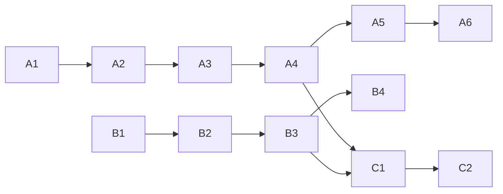

# PLAN — Phase 4 (Motion Vector Modulation) + Audio FSK Clock

**Date:** 2026-09-03 **Status:** Approved plan, not started
**Design ADRs:** `F-20260903-01-phase4-motion-vector-design.md`,
`F-20260903-02-audio-fsk-clock-design.md` (both `Accepted`; flip to `Implemented` in the
commits that land A5/B4 respectively)
**Backlog items:** `Phase 4: Motion Vector Abuse`, `Audio-assisted clock synchronization`

Two workstreams. **A (Phase 4)** and **B (FSK)** are independent until stage **C (combined
clock)**. Every stage ends with the full test suite green
(`dotnet test YTAHD.Tests/YTAHD.Tests.csproj`) and Phase 1–3 behavior unchanged. Each stage
is one commit with its ADR (`F-YYYYMMDD-NN` for A/B stages, per repo convention).

---

## Design constants (fixed unless M5/B4 measurement forces change)

| Constant          | Value                                     | Rationale                                       |
| ----------------- | ----------------------------------------- | ----------------------------------------------- |
| Tile texture size | 8×8 px baseline (4 and 16 swept in A5)    | Reliability baseline; 4×4 is density experiment |
| Offset alphabet   | 4 bits/axis, 2 px steps, `(0,0)` excluded | Above H.264 ¼-pel precision; hold-frame safe    |
| Cell size         | texture + 2×max offset (guard margin)     | Shifted tile never leaves its cell              |
| Border            | 32 px neutral gray                        | Matches Phase 3 contract                        |
| Frame emission    | canonical/displaced alternation           | Single-frame decode, duplicate-safe             |
| Texture seed      | fixed protocol constant                   | Decoder regenerates reference without side data |
| FSK frequencies   | 1000 Hz hold / 1500 Hz datagram pulse     | Survives AAC/Opus; per README                   |
| FSK pulse length  | 2 video frames (~33 ms)                   | AAC frame = 1024 samples > 1 video frame        |
| FSK detection     | 2-bin Goertzel, frequency ratio only      | Immune to loudness normalization                |

---

## Workstream A — Phase 4 modulator

### A1. Tile basis + offset alphabet

- New `YTAHD.Core/Modulation/MotionTileBasis.cs`:
  - Deterministic band-limited tile texture from a fixed seed (peaked autocorrelation,
    low high-frequency energy so the codec keeps it).
  - Offset alphabet codec: `byte ↔ (dx, dy)` (4+4 bits, 2 px steps, `(0,0)` never emitted).
- Tests: `MotionTileBasisTests` — alphabet round-trip for all 256 values, determinism,
  texture autocorrelation sharpness (self-match beats best off-by-one-step match by margin).

### A2. `MotionVectorModulator : IModulator`

- New `YTAHD.Core/Modulation/MotionVectorModulator.cs`:
  - `GetPayloadBytesPerFrame` / `GetPacketBufferLength` / `GetBorderWidth` from cell geometry.
  - `CreateFrame` renders displaced layout from payload; canonical layout for empty payload.
  - Single-tile `Encode`/`Decode` (mirrors `DctModulator`'s single-block contract).
- Tests: `MotionVectorModulatorTests` — geometry/capacity math, lossless render→decode
  round-trip, canonical-frame rendering.

### A3. `MotionFrameBitDecoder`

- New decoder in `YTAHD.Core/Core/` + registration in `FrameBitDecoderFactory`:
  - Per-tile SAD full search over the offset alphabet against the seeded reference
    (~225 candidates/tile); confidence = margin between best and second-best match.
  - Canonical-frame detection: dominant `(0,0)` best-match across tiles → "no data" signal.
- Tests: synthetic degradation before any real codec — Gaussian noise (σ up to 8), 3×3 box
  blur, ±10 luma shift; assert byte-accuracy threshold and canonical detection.

### A4. Pipeline integration

- `EncoderEngine`: replace the hard-coded `for (rep < 3)` with a modulator-driven emission
  pattern (new small interface or `IModulator` capability object: repeat count + interleaved
  canonical frames). Phase 1–3 keep the literal 3× behavior — regression-locked by tests.
- `DecoderEngine` / `DecodeStreamOrchestrator`: canonical frames terminate duplicate runs
  instead of feeding the packet path; displaced frames decode single-frame as today.
- `YTAHD.Cli/Program.cs`: `phase4` / `motion` modulator mode (encode + decode options text).
- Tests: fake-wrapper round-trip via `YtahdCodecService`, Phase 1–3 byte-identical
  regression, orchestrator canonical/displaced sequencing tests.

### A5. Real FFmpeg validation + tuning — done

- `probe` gains phase4 mode (`Program.cs`); real libx264 CRF-23 round-trip integration tests
  added to `YtahdCodecServiceTests.cs`
  (`RealFfmpeg_LargerPayloadMatrix_RoundTrips_For_Phase4`: 16/64/256-byte payloads spanning
  multiple frames and parity groups; `RealFfmpeg_MotionVectorModulator_SingleFrame_RoundTrip_DoesNotHang`).
- Exit gate met: 100% payload recovery on the real libx264 round-trip with the shipped 8×8
  texture / 2 px-step / 16 px-guard defaults, zero false invalid-packet classifications.
- **Scope decision:** the originally planned 4×4/16×16 tile-size sweep was deferred rather
  than done in this pass — it requires parameterizing `MotionTileBasis`'s currently-hardcoded
  texture-size constants across already-tested A1–A4 code, and the 8×8 baseline already
  clears the exit gate. Tracked as a follow-up tuning experiment in `docs/BACKLOG.md`, not a
  blocker. See ADR `F-20260903-01-phase4-motion-vector-design.md` (now `Status: Implemented`).

### A6. Perf + docs — done

- `YTAHD.Perf`: `phase4` capacity/overhead entry added (`CalculatePhase4PayloadBytesPerFrame`,
  mirrors `MotionVectorModulator` geometry; defaults `--repeat` to 2 for `phase4` unless the
  caller overrides it, matching the displaced+canonical emission pattern).
  README updated to implemented status with real-codec validation results. The
  "Phase 4: Motion Vector Abuse" backlog item was replaced by the (now `Implemented`) ADR;
  the deferred tile-size sweep and stage-C2 research ideas were split into their own small
  backlog follow-up items.

**Workstream A (Phase 4) complete: A1–A6 all done, 142/142 suite green throughout.**

---

## Workstream B — Audio FSK clock (independent of A until C)

**Status: complete (B1–B4), 162/162 suite green throughout.**

### B1. Real FSK synthesis — done

- `FskGenerator`: phase-continuous 16-bit PCM tone segments aligned to fps
  (`WriteHoldToneAsync`, `WritePulseAsync`), amplitude-ramped transitions.
- Tests: segment lengths, phase continuity at boundaries (no sample discontinuity),
  spectral check via Goertzel self-test.

### B2. Audio mux/demux in the FFmpeg layer — done

- `IFFmpegWrapper.StartAsync` gains an optional audio input (second pipe or temp WAV +
  `-i` + `-c:a aac`); remove `-an` only when audio is supplied.
- Decode side: extract audio track to PCM (`-vn -f s16le`); absent track → null, feature off.
- `VideoCodecOptions.UseAudioClock` (default `false`) threaded through
  `EncodeOptions`/`DecodeOptions` and CLI flag `--audio-clock`.
- Tests: fake-wrapper arg assertions; real ffmpeg smoke check that mux+extract round-trips.

### B3. Goertzel detector + pulse-to-frame alignment — done (scoped)

- New `YTAHD.Core/Audio/GoertzelDetector.cs`: 2-bin energy ratio per window,
  hysteresis, measured stream delay offset.
- `DecodeStreamOrchestrator`/`DecoderEngine`: optional audio-derived datagram count
  (`DecodeMetrics.AudioDatagramCount`) surfaced for comparison against the video-decoded
  logical frame count. **Scope note:** wiring a disagreement into actual erasure indices for
  the parity/durability layer (as originally envisioned) is deferred — see `docs/BACKLOG.md`.
- Tests: detector on synthetic noisy PCM (lowpass-smeared), the documented Phase
  4/FSK cadence conflict, orchestrator/`DecoderEngine` wiring.

### B4. Real AAC round-trip validation — done

- libx264+AAC integration test (16/64/256-byte payloads): audio-derived datagram count
  matched the video logical frame count exactly on this ffmpeg build, within the documented
  ±2 frame tolerance. `-strict -2` required for this build's experimental AAC encoder.
- Exit gate met; ADR `F-20260903-02-audio-fsk-clock-design.md` updated with findings
  (now `Status: Implemented`).

---

## Workstream C — Combined clock (after A4 + B3)

### C1. Clock arbitration

- Motion markers = fine clock (frame-exact), FSK pulse count = coarse absolute counter.
- Arbitration rule in the orchestrator: agreement → proceed; disagreement → trust FSK count
  for _how many_ datagrams elapsed, mark missing indices as erasures for durability recovery.
- Real-codec test: forced frame drops (`-vf select` decimation) recovered via combined clock
  - durability matrix.

### C2 (research follow-up, separate backlog item when C1 lands)

- Motion-synced Phase 3: sparse always-moving marker tiles (~2–4% area) as frame clock for a
  1-frame DCT lifespan (~7.1 MB/s theoretical vs ~2.47 MB/s today).

---

## Sequencing



Recommended order for a single developer: A1→A2→A3 (pure library code, fast feedback),
then B1→B2 in parallel-friendly isolation, A4, B3, A5, B4, C1, A6.

## Validation commands (per stage)

```powershell
dotnet test YTAHD.Tests/YTAHD.Tests.csproj --logger "console;verbosity=minimal"
dotnet run --project YTAHD.Cli -- encode sample.bin out.mp4 --modulator phase4
dotnet run --project YTAHD.Cli -- decode out.mp4 recovered.bin --modulator phase4
```
